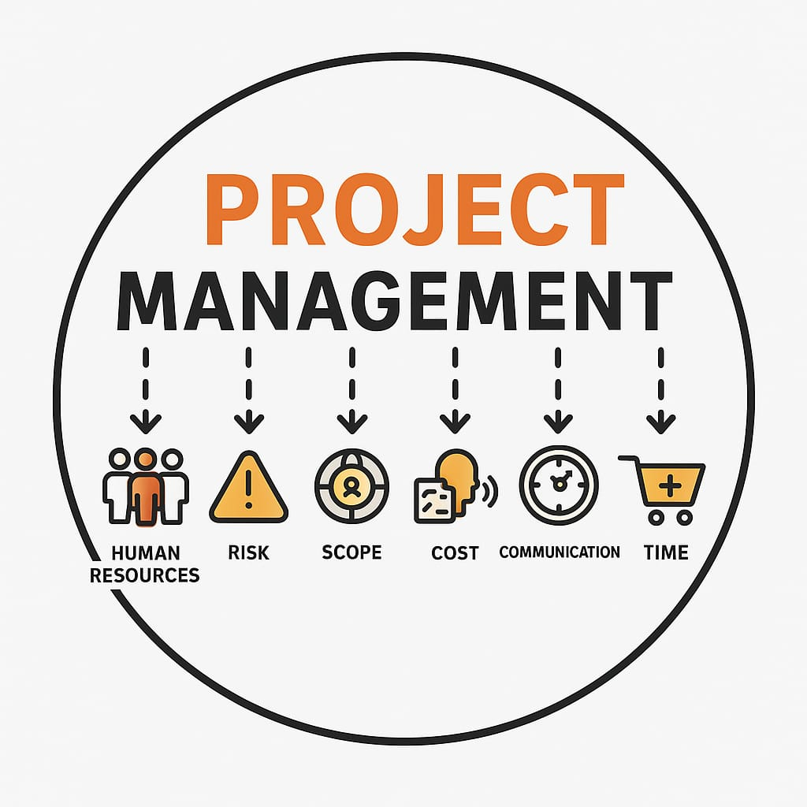
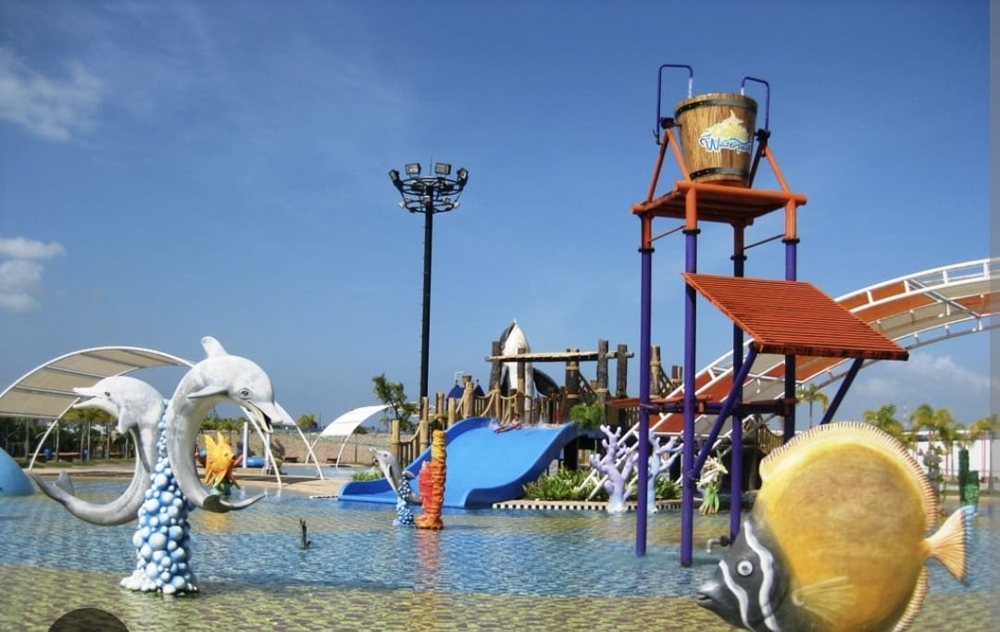
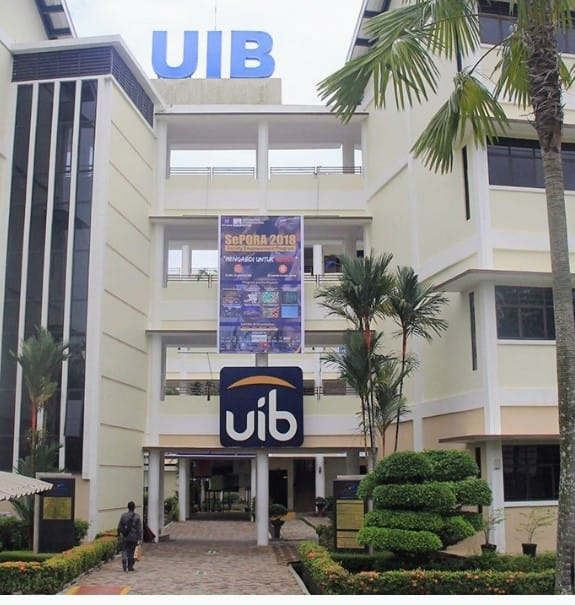

# Gonita 

Selamat datang di portfolio saya!  
Saya seorang **Engineer Teknik Sipil & Construction Project Manager** yang berfokus pada manajemen proyek, real estate, industrial, dan komersial.

---

## Tentang Saya
Saya memiliki pengalaman lebih dari 15 tahun di bidang **manajemen proyek konstruksi**, mulai dari perencanaan biaya, penjadwalan, hingga penyelesaian proyek multi-juta dolar.  
Latar belakang pendidikan saya: **Teknik Sipil - Universitas Gadjah Mada**, dan melanjutkan studi di **Hunter College, New York**.

Biasa bekerja dengan tim lintas divisi, berkoordinasi dengan arsitek, kontraktor, hingga pejabat lokal, memastikan proyek selesai tepat waktu dan sesuai anggaran.

---

## Keahlian & Badge

- **Manajemen Proyek Konstruksi** 
- **Estimasi & Pengendalian Biaya** 
- **Negosiasi & Kontrak** 
- **Site Management & Laporan Proyek** 
- Bahasa: Indonesia, Inggris, Mandarin

---

## Proyek Utama

| Proyek | Deskripsi | Gambar |
|--------|-----------|--------|
| Kawasan Bintang Industrial Park II | Mengelola pembangunan kawasan industri seluas 70 hektar, termasuk infrastruktur utama dan bangunan industri |  |
| Ocarina & Ocarina Waterpark | Memimpin pengembangan taman hiburan dan waterpark di Batam, selesai tepat waktu dan sesuai anggaran | |
| Gedung Universitas (UIB) | Mengawasi pembangunan kampus universitas, berhasil menyelesaikan proyek dengan penghematan 10% dari anggaran |  |

---
## Quote Profesional
> "Kualitas dan ketepatan waktu adalah prioritas utama dalam setiap proyek."

> "Selalu utamakan keselamatan dan kualitas di setiap tahap proyek."

> "Kolaborasi tim adalah kunci keberhasilan proyek konstruksi."
---
## Hobi & Minat
Selain konstruksi, saya menikmati **baking & eksperimen resep baru**.  
Melatih ketelitian, kreativitas, dan inspirasi baru.

---
## Checklist Keahlian
- [x] Manajemen Proyek
- [x] Koordinasi Departemen Terkait
- [x] Kontrol Anggara
- [x] Site Management
---

## Kontak
📧 Email: donita.kwek@gmail.com  
💼 LinkedIn: [LinkedIn Gonita](https://www.linkedin.com/in/gonita-6072b0bb/)  
🖥 GitHub: [GitHub Gonita](https://github.com/nitagonita)  

---

  

